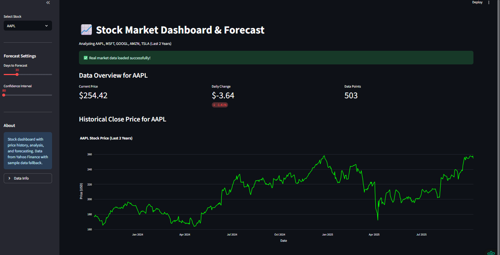
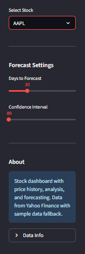
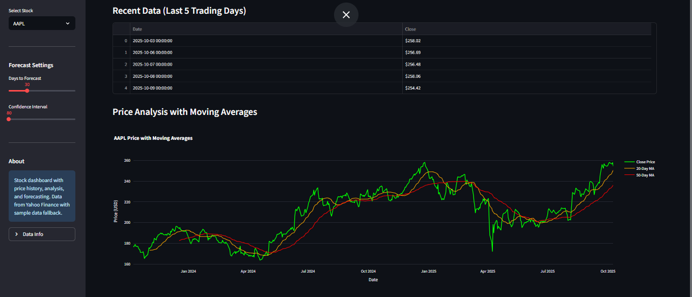
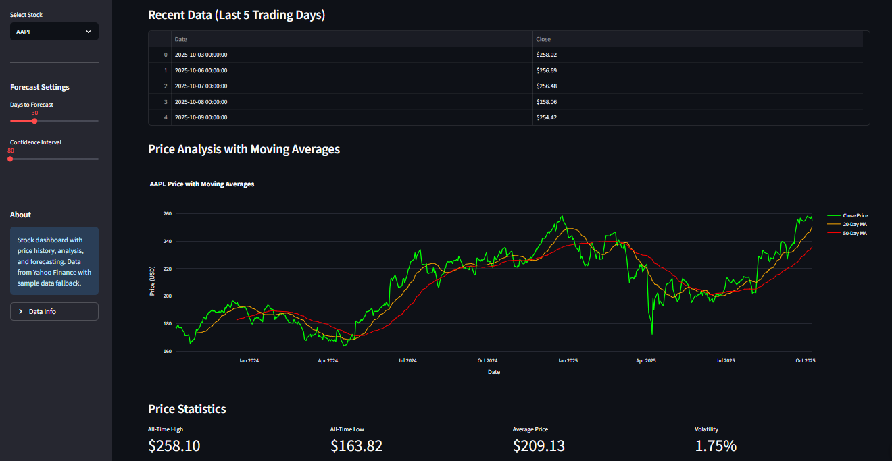
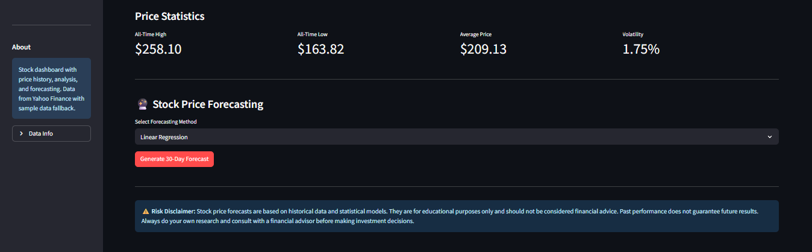

# 📈 Stock Market Dashboard & Forecast

A comprehensive Streamlit web application for analyzing stock market data and generating price forecasts. This dashboard provides real-time stock data visualization, technical analysis, and predictive forecasting for major tech stocks.

## 🚀 Live Demo
[Add your live Streamlit share link here]

## 📋 Table of Contents
- [Features](#features)
- [Screenshots](#screenshots)
- [Installation](#installation)
- [Usage](#usage)
- [Project Structure](#project-structure)
- [Technical Details](#technical-details)
- [Forecasting Methods](#forecasting-methods)
- [Risk Disclaimer](#risk-disclaimer)
- [Contributing](#contributing)
- [License](#license)

## ✨ Features

### 📊 Real-time Data Analysis
- **Live Stock Data**: Fetches real-time data for AAPL, MSFT, GOOGL, AMZN, and TSLA
- **Historical Performance**: 2 years of historical price data visualization
- **Interactive Charts**: Interactive Plotly charts with hover details
- **Recent Data Table**: Last 5 trading days data in formatted tables

### 📈 Technical Indicators
- **Moving Averages**: 20-day and 50-day moving averages
- **Price Statistics**: All-time high/low, average price, and volatility metrics
- **Trend Analysis**: Daily price changes and percentage movements

### 🔮 Predictive Forecasting
- **Multiple Methods**: Three different forecasting algorithms
- **Customizable Periods**: Forecast from 7 to 90 days into the future
- **Confidence Intervals**: Adjustable confidence levels for predictions
- **Visual Projections**: Combined historical + forecast charts

## 📸 Screenshots

### 1. Main Dashboard Overview

*The main dashboard showing AAPL stock overview with current price, daily change, and data points count. Features a clean, dark-themed interface with real-time metrics.*

### 2. Sidebar Configuration

*Configuration panel allowing users to:*
- *Select different stocks (AAPL, MSFT, GOOGL, AMZN, TSLA)*
- *Adjust forecast duration (7-90 days)*
- *Set confidence intervals for predictions*
- *Access data information and app details*

### 3. Technical Analysis Charts

*Advanced charting features including:*
- *Historical price trends with interactive zoom*
- *Moving average overlays (20-day and 50-day)*
- *Clean visualization of price movements over time*

### 4. Recent Data & Statistics

*Comprehensive data display featuring:*
- *Recent trading data in formatted tables*
- *Key price statistics (All-time High/Low, Average Price)*
- *Volatility metrics and trend indicators*
- *Moving average analysis*

### 5. Forecasting Interface

*Predictive analytics section with:*
- *Multiple forecasting method selection*
- *One-click forecast generation*
- *Risk disclaimer and educational warnings*

## 🛠️ Installation

### Prerequisites
- Python 3.8 or higher
- pip package manager

### Step-by-Step Installation

1. **Clone the repository**
```bash
git clone https://github.com/yourusername/stock-dashboard.git
cd stock-dashboard
```

2. **Create virtual environment (recommended)**
```bash
python -m venv venv
# On Windows:
venv\Scripts\activate
# On Mac/Linux:
source venv/bin/activate
```

3. **Install required packages**
```bash
pip install -r requirements.txt
```

If requirements.txt is not available, install manually:
```bash
pip install streamlit yfinance pandas numpy plotly
```

## 🎯 Usage

### Running the Application
```bash
streamlit run app.py
```

The application will open in your default browser at `http://localhost:8501`

### How to Use

1. **Select a Stock**: Choose from AAPL, MSFT, GOOGL, AMZN, or TSLA in the sidebar
2. **View Current Metrics**: Check the current price, daily changes, and data statistics
3. **Analyze Charts**: Interact with the historical price chart and moving averages
4. **Configure Forecast**: Set your preferred forecast days and confidence level
5. **Generate Predictions**: Click "Generate Forecast" to see future price projections

## 📁 Project Structure

```
stock-dashboard/
├── app.py                 # Main Streamlit application
├── requirements.txt       # Python dependencies
├── README.md             # Project documentation
├── screenshots/          # Application screenshots
│   ├── dashboard-overview.png
│   ├── sidebar-settings.png
│   ├── technical-charts.png
│   ├── data-statistics.png
│   └── forecasting-interface.png
└── .gitignore           # Git ignore file
```

## 🔧 Technical Details

### Data Sources
- **Primary**: Yahoo Finance API via `yfinance` library
- **Fallback**: Generated sample data when live data is unavailable
- **Update Frequency**: Real-time during market hours

### Libraries Used
- `streamlit` - Web application framework
- `yfinance` - Stock data API wrapper
- `pandas` - Data manipulation and analysis
- `plotly` - Interactive data visualization
- `numpy` - Numerical computations

## 📊 Forecasting Methods

### 1. Trend Projection
- Uses linear regression to identify price trends
- Projects future prices based on historical slope
- Best for stocks with clear upward or downward trends

### 2. Moving Average Extrapolation
- Analyzes recent price momentum
- Extends moving average trends into the future
- Effective for trending markets

### 3. Volatility-Based Projection
- Models price movements as random walks
- Uses historical volatility patterns
- Suitable for range-bound or volatile stocks

## ⚠️ Risk Disclaimer

**Important**: This application is designed for educational and research purposes only. 

- Stock price forecasts are statistical projections based on historical data
- Past performance does not guarantee future results
- The forecasts should not be considered financial advice
- Always conduct your own research and consult with qualified financial advisors before making investment decisions
- The developers are not responsible for any financial losses incurred from using this application

## 🤝 Contributing

We welcome contributions! Please feel free to submit pull requests or open issues for:

- New forecasting algorithms
- Additional technical indicators
- UI/UX improvements
- Bug fixes and performance enhancements

### Contribution Guidelines
1. Fork the repository
2. Create a feature branch (`git checkout -b feature/AmazingFeature`)
3. Commit your changes (`git commit -m 'Add some AmazingFeature'`)
4. Push to the branch (`git push origin feature/AmazingFeature`)
5. Open a Pull Request

## 📄 License

This project is licensed under the MIT License - see the [LICENSE](LICENSE) file for details.

## 📞 Support

If you encounter any issues or have questions:

1. Check the [Issues](https://github.com/yourusername/stock-dashboard/issues) page
2. Create a new issue with detailed description
3. Include relevant screenshots and error messages

## 🚀 Future Enhancements

- [ ] Add more stocks and cryptocurrencies
- [ ] Implement additional technical indicators (RSI, MACD, Bollinger Bands)
- [ ] Portfolio management features
- [ ] Email/SMS alerts for price movements
- [ ] Backtesting capabilities
- [ ] Social sentiment analysis integration

---

## 👤 Author

* GitHub: @Iceyma02(https://github.com/Iceyma02)
* LinkedIn: Anesu Manjengwa(http://linkedin.com/in/anesu-manjengwa-684766247)
